# Ender 3 Pro - Modeling and Benchmarking

## Project Ideation

As an amateur 3D printing enthusiast and lover of all things manufacturing, I’ve
always fantasized about the idea of starting a 3D printing business. However, when I 
think about the business model, it seems... not so great. With the ease of access to 
quality off-the-shelf 3D printers, the dynamics of the market are competitive
(no moats besides capital and technical knowledge), which drives down margins close 
to the production cost per item. If `profit = revenue - cost`, where a simple model 
of revenue is `sale price per item * number of items sold` and cost is `cost per item sold * number of items sold`, then the firm that does the following survives:

1. Minimizes cost per item produced
2. Maximizes quality per item
3. Minimizes delivery time per item

I’ll label these as the **_Big 3_**.

No duh, so what?

Yeah, not a viral post with what I just said, and it’s an oversimplification, but I 
used some interesting terminology. Minimize/Maximize… this sounds like a fun 
multivariate optimization problem that I can explore in my home lab.  Additionally, 
building a model of my printer to optimize could be useful to then model the economics of 
an actual 3D print farm business.

I want to tackle the smallest unit of this problem to start, so I’m going to cheat 
and skip over messy details that an actual business would need to deal with. 

My Assumptions:
- My marketing department is amazing, and I have infinite orders. Therefore, as long 
as my printer is running, I’m making money.

- My distribution channels are flawless and free and will deliver products as fast 
as I can get them off the printer. Therefore, it should always be running.

- I am constrained to having just one printer, but every improvement I make should 
scale to more printers.

- I will ignore failure rates for now. This is an important factor as it contributes 
to cost, but hey, I said I was starting small.

## Goals

Given those assumptions, my goals are to model the performance of my printer, use the model to calculate the **_Big 3_**, and identify where the most significant improvements can be made.

### Methodology

To achieve my goals, I'll need to do the following:

1. **Determine what to measure:** I need to think about what to measure, and how I'm going to 
measure it.
2. **Model the printer**: Given the measurements, I need to explore how to piece them together.
3. **Run a benchmark:** I'll need to run a benchmark to measure the 
performance and input them into the model.

In this post, I’ll focus on the above tasks, but in future posts I’ll experiment with 
improvements and enhance the model further.

I’m a software engineer by trade, so I expect there is lots of edge I can eek out in 
the software stack, but I’m also interested in what processes (both mechanical and 
human) I can introduce to reduce things like labor cost, printer idleness, and input 
consumption.


## Starting Lab Equipment

Let me introduce the 3D printer I’ll be using. I need to itemize the base model 
plus all of its upgrades to define the printer’s capabilities **_C_**, and record them for
comparison in the future.

<div style="display: flex; flex-wrap: wrap; justify-content: center; gap: 10px;">
  <div style="text-align: center; margin: 10px;">
    
    <p style="font-style: italic;">Ender 3 Pro</p>
  </div>
  <div style="text-align: center; margin: 10px;">
    
    <p style="font-style: italic;">Dual Gear Extruder</p>
  </div>
  <div style="text-align: center; margin: 10px;">
    
    <p style="font-style: italic;">Hot-End with BL Touch and Noctua Fan</p>
  </div>
</div>

<div style="display: flex; flex-wrap: wrap; justify-content: center; gap: 10px;">
  <div style="text-align: center; margin: 10px;">
    
    <p style="font-style: italic;">SKR Mini E3 V2.0 with TFT35 E3 V3.0 Display</p>
  </div>
  <div style="text-align: center; margin: 10px;">
    
    <p style="font-style: italic;">Glass bed and clips</p>
  </div>
  <div style="text-align: center; margin: 10px;">
    
    <p style="font-style: italic;">Ender 3 Pro with Raspberry Pi</p>
  </div>
</div>

I probably didn't need all of those upgrades to start this project, but in the process of 
installing them (some were required due to me breaking the original stock piece), flashing 
new Marlin firmware, automating Octoprint, and printing a ton of cool things, I learned enough 
to inspire me to write this post. I would say that was a worthwhile investment. 
$486 is the dollar amount of initial capital expenditure to be used in any future equations.

I’ve chosen to do this project with the Ender 3 Pro because of the wealth of tutorials, 
ideas, and schemes the community has produced and openly shared. There are plenty of more 
advanced printers (💰💰💰) that come with these upgrades stock, but I want to dive 
into the stack, and some of those other printers are not as open source. 

See the [Appendix](#Appendix) for the list of parts, their price, and links to sellers.

# What To Measure 

Now that the base lab equipment’s **_C_** is defined, I want to tackle what and how I’m going 
to measure. I can immediately think of a few things that are important...

1. Print duration(s)
2. Amount of filament used
3. Energy consumed by the printer system

Some squishier things to measure…

1. Labor costs
2. Quality of print

### Print Duration

Let’s cover the less squishy things first. I’m driving the printer from
the SKR mini motherboard, but the control flow comes from
[Octoprint](https://octoprint.org/) running on the Raspberry Pi. It's a free
open-source control and monitoring solution, and you should consider 
[donating](https://octoprint.org/support-octoprint/). You can do a ton
of stuff with it stock, but it also has a vibrant open source plugin 
ecosystem (awesome for a good ol’ SWE like myself because I can just hack 
other people's work together). As I run this and future benchmarks, I don’t 
really want to waste my time recording the data by
hand and almost all the data I want to measure is something that 
Octoprint must have insight on. So what can I do? Surely Octoprint MUST
have some plugin that can aggregate statistics for me. 

Turns out it does. The [octoprint-stats](https://github.com/AlexVerrico/octoprint-stats) 
plugin does all the hard work of hooking into the existing event 
channel and recording some already useful data into a database and a 
JSON file 😱. After scrolling through the code I found that I can scrape 
the JSON file for `PRINT_COMPLETE` events and parse `print_duration`, 
`bed_temperature`, `tool_temperature`, `estimated_filament_use`, and 
`file_name`. 

Given this, I wrote a short 
[python script](https://github.com/DanielThurau/octoprint-stats-scraper) that runs on the Raspberry
Pi once a minute, scrapes the data I want, uploads it to a Google sheet
using [gspread](https://docs.gspread.org/en/latest/), and clears the JSON file to keep duplicate events from 
being recorded. It will write rows to a table like so:

<div style="text-align:center">
    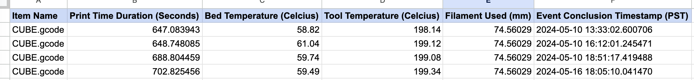
</div>

So now I have the duration of a single print and I can add multiple durations together, 
but the duration is a function of the item being printed, and the printing speed. 
Printing speed itself is complicated too, given that most printers do a slower first layer,
and have different speeds for different parts of the printed structure.
The items will be constant across comparable benchmarks, but the printing speed may be something
I experiment with in the future. Therefore, it should also be recorded in the spreadsheet as well. 

Unfortunately, this has to be inputted by hand for now as it’s easiest to 
extract the printing speed from the slicer. There are, however, many layers 
between the slicer and the printer that can affect printing speed; 
eventually I will need a more accurate way to automatically measure the
speed, and I'll integrate it to the spreadsheet then. 


### Filament Used 

Octoprint-stats outputs estimated filament used. I have yet to 
discover how this is calculated, but I suspect its metadata 
from the slicer. I have to collect some empirical evidence to verify its 
accuracy then. By marking filament in 10 cm increments, I could measure 
the distance left between marks after the print and verify the accuracy. 
I learned this trick from [Casual DIY](https://youtu.be/qoj6PE7bkfc?t=558) 
when learning how to modify E-steps. 


<div style="display: flex; flex-wrap: wrap; justify-content: center; gap: 10px;">
  <div style="text-align: center; margin: 10px;">
    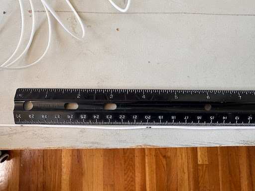
    <p style="font-style: italic;">Confirming Filament Consumed</p>
  </div>
</div>

This experiment led
to a +/- 2 mm difference between consumed and estimated filament usage. 
This is temporarily acceptable to me for two reasons:

1. I imagine I can get a more accurate representation in the future either 
by checking consumed weight in kg, or estimate the amount of filament 
extruded via the GCode instructions to the extruder. 
2. Filament is very cheap (see calculations soon). 1 mm of filament will
contribute a small fraction of the overall production cost.

<div style="display: flex; flex-wrap: wrap; justify-content: center; gap: 10px;">
  <div style="text-align: center; margin: 10px;">
    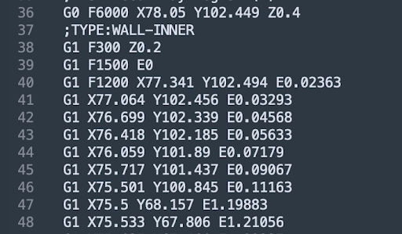
    <p style="font-style: italic;">GCode Example</p>
  </div>
</div>

To eventually measure the performance of the benchmark, I’ll need to add 
all the estimated filament used (because that's what I have for now) and multiply it by the cost of the filament 
in `dollars / millimeter ($/mm)`. In most cases, filament is sold by the 
kilogram, so I decided to figure out the `$/mm` myself. For 
[Elegoo black PLA filament](https://www.amazon.com/ELEGOO-Filament-Dimensional-Accuracy-Cardboard/dp/B0BM7465PB), 
I bought `1kg` for `14.40 $/kg`. I did some weighing and measured `660 mm/gram`
for this type of filament (PLA). Plug these into an equation and solving for `$/mm` 
produces `0.00002181818 $/mm`.

### Power Consumption

To measure the power consumption of the printer system (this includes 
the actual 3D printer, the Raspberry Pi running Octoprint, and the 
monitor), I needed to measure the amount of kilowatt-hours (kWh) consumed over the 
duration of a print, and during idle time during the benchmark. From 
that, I can apply my local electricity rate (`29 cents/kWh` in San 
Francisco). 

I wanted an open source and programmatic solution, and my 
research didn't find any reasonably priced consumer products that balanced 
this (there were many commercial products, but that defeated the 
purpose of being cost-effective).

Luckily I was saved by Radek Kozieł's [Sonoff S31](https://www.apalrd.net/posts/2021/tasmota_day/) 
flashing blog post. With [Tasmota’s](https://tasmota.github.io/docs/) open source 
firmware, the Sonoff S31 becomes a super cheap power meter. I plugged in the 
extension cord cable of the whole system, and the Sonoff started publishing MQTT telemetry events. 
I was able to set up an [MQTT](https://mqtt.org/) broker 
on my home server and I wrote a [data pipeline](https://github.com/DanielThurau/amleth) that 
dumped all of this telemetry data into a SQLite database, including the difference in kWh 
consumed between telemetry events. I can now use this timeseries to plot kWh over the entire print. 

<div style="display: flex; flex-wrap: wrap; justify-content: center; gap: 10px;">
  <div style="text-align: center; margin: 10px;">
    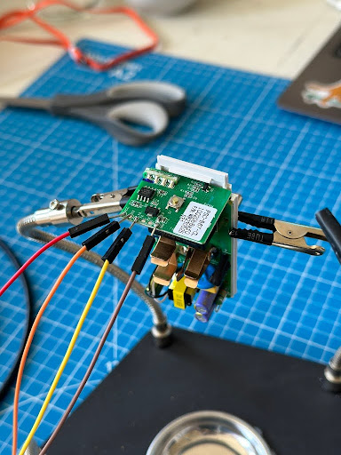
    <p style="font-style: italic;">Flashing Tasmota to the Sonoff S31</p>
  </div>
</div>

### Labor Costs

For labor cost, I won’t be counting the R&D costs I’m accruing by 
running this project as (1) I’m doing it myself, and (2) it's 
theoretically a one-time cost that I can scale across any number of 
printers in the future. I will be recording the time I spend 
doing the manual labor of conducting the benchmark, like scheduling the
print using Octoprint’s Web UI, removing prints from the build plate, 
and removing supports. 

As this is trainable work, the cost being accumulated in the benchmark 
will be charged at minimum wage where I live in California: $16 / hour.

### Print Quality 

The outcomes I’m trying to optimize for are somewhat at odds with each 
other. For instance, it’s reasonable to assume that maximizing the 
speed of delivery (i.e. print speeds) could negatively affect the quality of the prints. 
Additive manufacturing with polymers is a delicate process where you 
balance speed and temperature. Move too fast and layers can’t cool fast
enough, reducing some measures of their quality. So it's important to include this
in the printer's performance. If quality is not met, then the business dies because 
the customer will eventually go somewhere else.

There are two things that I immediately think of when I think of how to measure quality: 

1. Dimensional accuracy
2. Structural integrity

I am treating quality as a minimum standard for now, either a `pass` or a `fail` grade and I'll only be 
considering (1) until I have a higher quality structural integrity 
testing rig. The process of evaluating will be for me to 
measure the dimensions with my calipers and see if there is any 
warping, and decide a grade for the print. 

## What Am I Going To Print?

I want to have a set of objects I will print (S), measure their cost, delivery, and determine their 
quality. I am starting this project with simple prints, but I have no 
doubt I’ll update this later and establish new benchmarks. I chose:

1. A cube to see how the printer handles straight edges, and eventually to measure compressive resistance.
2. A hook to see how the printer handles rounded edges, and eventually to measure pulling resistance.
3. A crazy looking octagon that will test my printer’s ability to do complex features.

I’m printing with supports enabled, infill density set to 20% with the 
cubic pattern, and `2 mm` layer height. I suspect that there will be a 
future post tweaking MANY of these slicing parameters and observing 
their impact. This however introduces exponential growth of possible 
states since each unique print might benefit from different parameters.
Hopefully, with this method of experimentation, we will observe whether
slicing parameters is a dependent or independent variable as it 
concerns the Big 3 optimization problems I’ve outlined. 

<div style="display: flex; flex-wrap: wrap; justify-content: center; gap: 10px;">
  <div style="text-align: center; margin: 10px;">
    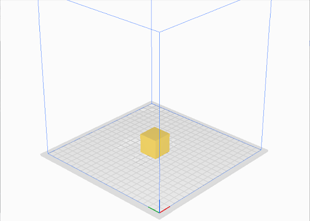
    <p style="font-style: italic;">CUBE</p>
  </div>
  <div style="text-align: center; margin: 10px;">
    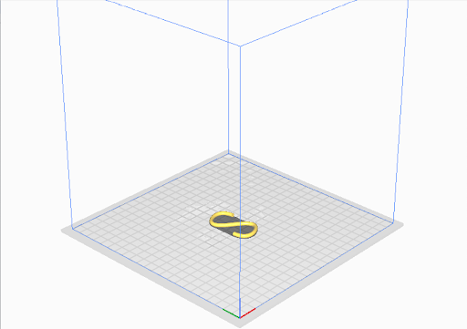
    <p style="font-style: italic;">HOOK</p>
  </div>
  <div style="text-align: center; margin: 10px;">
    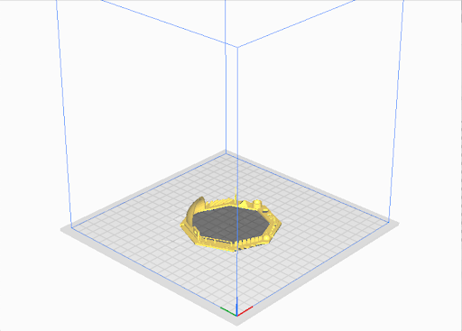
    <p style="font-style: italic;"><a href="https://www.thingiverse.com/thing:1363023">OCTAGON</a></p>
  </div>
</div>

## Modeling What I’m Trying To Do

Now let’s finally talk about the math. As I’ve said, I’m trying to 
optimize for quality, delivery time, and cost per item. I should have 
all the needed data to form a baseline from a benchmark, I 
just need to put it all together into some equations to compare between
runs:

$$
\text{cost per print set} = \sum \text{(filament usage cost)} + \sum \text{(power usage cost)} + \sum \text{(human labor cost)}
$$

$$
\text{delivery time} = \sum \text{(print time)} + \sum \text{(idle time)}
$$

$$
\text {quality} = \sum_{}^{} 
\begin{cases} 
1 & \text{if pass } \\ 
0 & \text{if fail} 
\end{cases}
$$

I can record the outcome from each of these equations and plot them 
over their set of capabilities C. As I said before, I suspect that as I
experiment with some improvements, the changes will help one equation 
but hurt another, plotting over time will help discover these 
relationships and allow for hypothesis to be tested.  Eventually, when 
I have enough data, and improvements on my capabilities C have resulted
in diminishing returns, I will try to optimize all three equations 
together.

## Running Benchmark 1 (Baseline)

It’s time to run the benchmark! Here is the procedure I followed:

1. Start a timer, and record the unix timestamp at the beginning of the experiment (for cross-referencing data)
2. Record duration of time taken to start print (1) 
3. Allow print (1) to finish printing
4. As soon as print (1) is finished, record the time it takes to clear 
the print bed, and start print (2). Retain print (1) item for quality
measurements later
5. Allow print (2) to finish printing
6. As soon as print (2) finishes, record the time it takes to clear the 
print bed, and start print (3). Retain print (2) item for quality 
measurements later
7. Allow print (3) to finish printing
8. As soon as print (3) finishes record the time it takes to clear the
print bed. 
9. Once print (3) item is retained, record the unix timestamp for
determining when the benchmark ends

I created a simple printable [spreadsheet](https://docs.google.com/spreadsheets/d/1It0CY4Cq8KmH4jIZ5J84eeLXb5Xb4M_dD_D9XHF9hlc/edit?usp=sharing) to help me record the results as I run the benchmark. 

### Results
<div style="display: flex; flex-wrap: wrap; justify-content: center; gap: 10px;">
  <div style="text-align: center; margin: 10px;">
    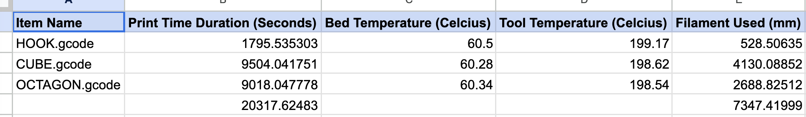
    <p style="font-style: italic;"><a href="https://docs.google.com/spreadsheets/d/1viSDG4_NQdTIaDTuc5jMEN4j0msnUhXYWto5N_62OMs/edit?usp=sharing">Complete Results</a></p>
  </div>
</div>

The software orchestration worked perfectly! No crashes or pesky bugs 🚀. Some interesting stats:

- Total Print Time: 5 hours, 38 minutes, 37 seconds
- Total Idle Time / Human Labor Time: 10 minutes
- Total Filament Used: 7347 millimeters (7.347 meters)
- Total Power Used: 0.667 kWh

<div style="display: flex; flex-wrap: wrap; justify-content: center; gap: 10px;">
  <div style="text-align: center; margin: 10px;">
    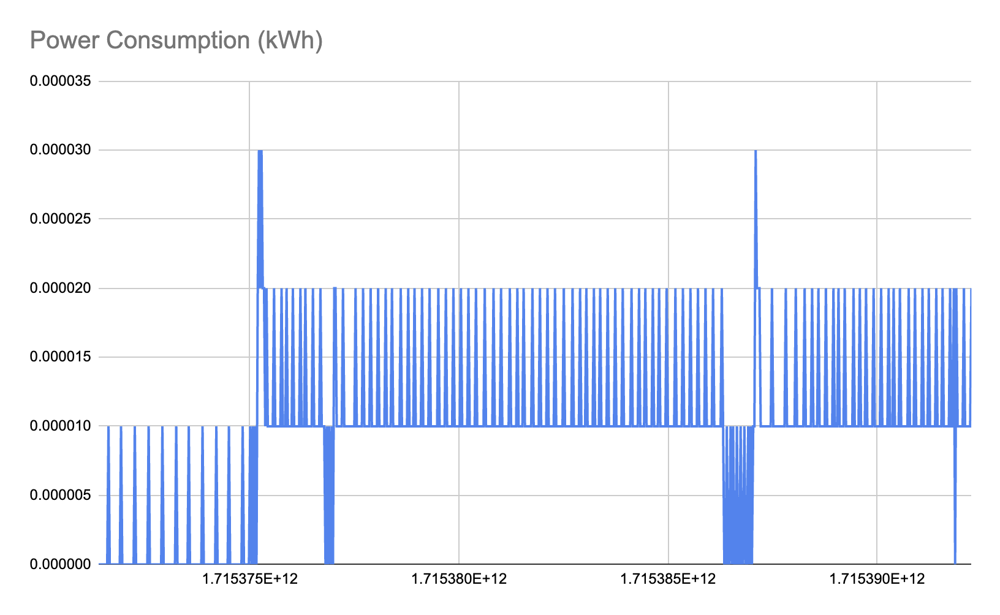
  </div>
</div>

Okay let’s analyze the performance.

#### Cost Per Print Set


```
cost per print set = ∑ filament usage cost+ ∑ power usage cost + ∑ human labor cost
                   = ((529mm + 4130mm + 2689mm) * (0.00002181818 $/mm)) + (0.667 kWh * 0.29 $/kWh) + (1 hour * 8 $/hour)
                   = $0.16031998664 + $0.19343 + $8.00
cost per print set = $8.36

```
#### Delivery Time 

```
delivery time  = ∑ print time + ∑ idle time
               = (1796 seconds + 9505 seconds + 9018 seconds) + 520 seconds
               = 20839 seconds
delivery time  = 5 hours 38 minutes 37 seconds
```

#### Quality


```
quality = ∑ {1 if pass, 0 if fail}
        = (1 + 1 + 1)
quality = 3
```

<div style="display: flex; flex-wrap: wrap; justify-content: center; gap: 10px;">
  <div style="text-align: center; margin: 10px;">
    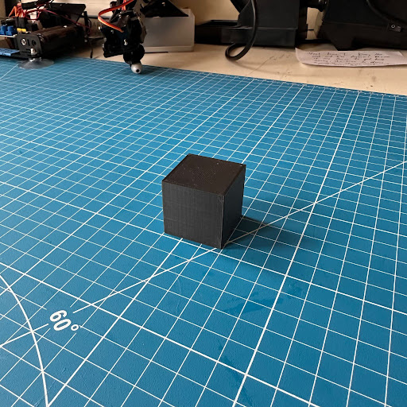
    <p style="font-style: italic;">Pass (1)</p>
  </div>
  <div style="text-align: center; margin: 10px;">
    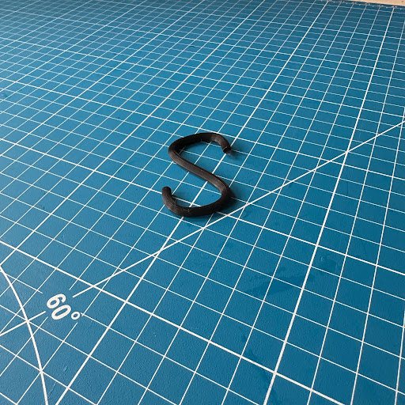
    <p style="font-style: italic;">Pass (1)</p>
  </div>
  <div style="text-align: center; margin: 10px;">
    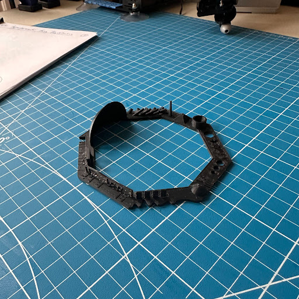
    <p style="font-style: italic;">Pass (1)</p>
  </div>
</div>

And that’s the benchmark! From here on, I can experiment with new 
processes and optimizations and compare them to these results as a 
baseline. 

<div style="display: flex; flex-wrap: wrap; justify-content: center; gap: 10px;">
  <div style="text-align: center; margin: 10px;">
    
  </div>
</div>

## What’s Next

Getting to this point took a while. Thinking about what to model, 
setting up an infrastructure for measuring data, and planning and 
conducting the baseline benchmark taught me a lot already, and this is 
a good foundation to continue from. 

I have three big goals I want to accomplish next:

1. Re-run the benchmark with different print speeds to see how this 
affects print duration and quality
2. Improve measurements of quality by creating a rig to test structural
integrity of the prints. This will be important as I explore other 
filament polymers.
3. Engineer continuous printing with a print queue. The largest cost 
input into the model was by far human labor. Engineering this was also 
the inspiration for this post, as I wanted to be able to compare how
much of an improvement continuous printing would be.


## Appendix

[1] Full breakdown of printer components with links to sellers:


| Item                                                                                                                  | Cost ($)            |
|-----------------------------------------------------------------------------------------------------------------------|---------------------|
| [Creality Ender 3 Pro](https://www.creality.com/products/ender-3-pro-3d-printer)                                      | 200                 |
| [Raspberry Pi 4 Model B](https://www.amazon.com/gp/product/B07TC2BK1X)                                                | 61                  |
| An old VGA capable monitor                                                                                            | 10                  |
| USB keyboard & mouse                                                                                                  | 20                  |
| [Dual Gear Extruder](https://www.amazon.com/gp/product/B0925J73Q9)                                                    | 16                  |
| [Creality 42-40 Stepper Motor (to fit the new extruder)](https://www.amazon.com/gp/product/B091CXPXVP)                | 10                  |
| [BL Touch](https://www.amazon.com/gp/product/B076PQG1FF)                                                              | 38                  |
| [BL Touch Servo Extension Cables](https://www.amazon.com/gp/product/B08DVFKTNB)                                       | 18                  |
| [Noctua A4x20 FLX Fan (24v)](https://www.amazon.com/gp/product/B072JK9GX6)                                            | 15                  |
| [BIGTREETECH SKR Mini E3 V2.0 with TFT35 E3 V3.0 Graphic Smart Display](https://www.amazon.com/gp/product/B088W6517D) | 72                  |
| [Buck Converters to handle the new voltages](https://www.amazon.com/gp/product/B01MQGMOKI)                            | 5 of used equipment |
| [Glass Bed](https://www.amazon.com/dp/B07RD6D2ZQ)                                                                     | 13                  |
| [Plate Clips](https://www.amazon.com/dp/B08PZKGJTR)                                                                   | 8                   |
| Total                                                                                                                 | 486                 |

[2] [Full results from the benchmark]( https://docs.google.com/spreadsheets/d/1viSDG4_NQdTIaDTuc5jMEN4j0msnUhXYWto5N_62OMs/edit?usp=sharing)